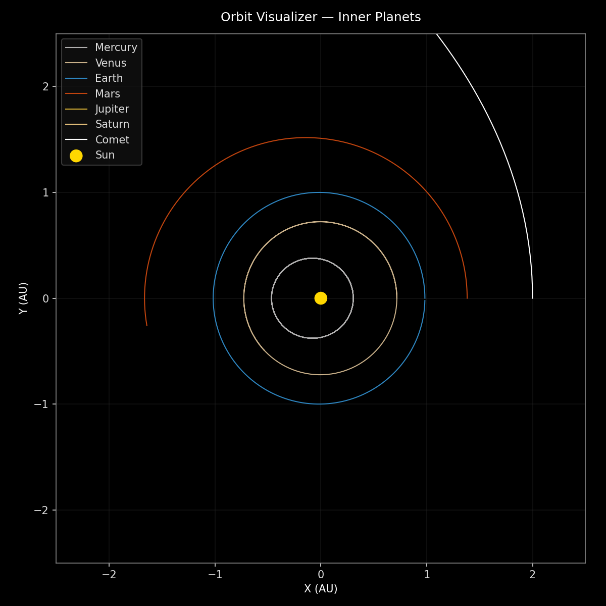

# Orbit Visualizer 🌍✨

A beginner-friendly Python project that simulates 2D Keplerian orbits (ellipses) and renders clean plots with a black background. Outputs PNG plots, an Excel ephemeris, and an optional GIF animation.

## Features
- Multiple bodies (Mercury ➜ Saturn) + a high-eccentricity comet
- Black background, yellow Sun, blue/green Earth, white comet
- Exports tidy `orbit_ephemeris.xlsx`
- Optional GIF animation if `imageio` is installed

<p align="center">
  
  <br>
  <em>Full system view generated by the Orbit Visualizer.</em>
</p>


## Quickstart
```bash
# 1) Create and activate a venv (Windows PowerShell)
python -m venv .venv
.venv\Scripts\Activate.ps1

# 2) Install deps
pip install -r requirements.txt

# 3) Run
python app.py
